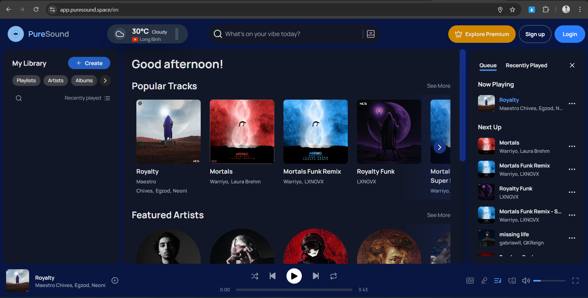

# PureSound Frontend - Pure Music Essence

> The modern web frontend for the PureSound music streaming platform.


## 1. About The Project

**PureSound Frontend** is the user interface for the PureSound music streaming. Built with performance and user experience in mind, it provides a seamless way for users to discover, stream, and manage their music library.

This application is built using **Next.js** and **TypeScript**, serving as the client-side counterpart to the Java/Spring Boot backend service.

### 1.1. Key Features

1.  **Modern UI/UX:** Responsive and interactive interface for music playback.
2.  **Music Streaming:** High-quality audio streaming capabilities.
3.  **Library Management:** Manage playlists, favorites, and user profiles.
4.  **Secure Authentication:** User login and registration integrated with the backend security layer.

## 1.2. Screenshot


## 2. Tech Stack

* **Framework:** [Next.js](https://nextjs.org/) (App Router)
* **Language:** [TypeScript](https://www.typescriptlang.org/)
* **Styling:** [TailwindCSS](https://tailwindcss.com/)
* **Component Library:** [HeroUI](https://www.heroui.com/)
* **Deployment:** [Vercel](https://vercel.com)

## 3. Getting Started

Follow these steps to set up the project locally on your machine.

### 3.1. Preparation

Ensure you have the following installed:
* **Node.js** (v18 or higher recommended)
* **npm**, **yarn**, or **pnpm**

### 3.2. Installation

1.  **Clone the repository**
    ```bash
    git clone https://github.com/dwngprogramming/puresound-frontend.git
    cd puresound-frontend
    ```

2.  **Install dependencies**
    ```bash
    npm install
    # or
    yarn install
    ```

3.  **Configure Environment Variables**
    Create a `.env` file in the root directory and configure your backend API endpoints:

    ```env
    NEXT_PUBLIC_API_URL=http://localhost:8080/api/v1
    ```

4.  **Run the development server**
    ```bash
    npm run dev
    # or
    yarn dev
    ```

    Open [http://localhost:3000](http://localhost:3000) with your browser to see the result.

## 4. Project Structure

```bash
puresound-frontend/
├── public/              # Static assets (images, icons)
├── src/
│   ├── app/             # Next.js App Router pages
│   ├── components/      # Reusable UI components
│   ├── lib/             # Utility functions and configurations
│   ├── hooks/           # Custom React hooks
│   └── services/        # API service calls (Axios/Fetch)
├── next.config.ts       # Next.js configuration
├── tsconfig.json        # TypeScript configuration
└── package.json         # Project dependencies
```

## 5. Contact
This is a personal project developed by Dung Pham Minh, an intern Frontend Developer. If you have any questions or feedback, please contact me via email.
- **Email:** [dwnq.coding@gmail.com](mailto:dwnq.coding@gmail.com) or [dungphamminh.dev@gmail.com](mailto:dungphamminh.dev@gmail.com)
- **My LinkedIn:** [LinkedIn](https://www.linkedin.com/in/dungphamminh/)

## 6. License
This project is licensed under the GNU General Public License v3.0 (GPLv3). See the [LICENSE](LICENSE) file for details.